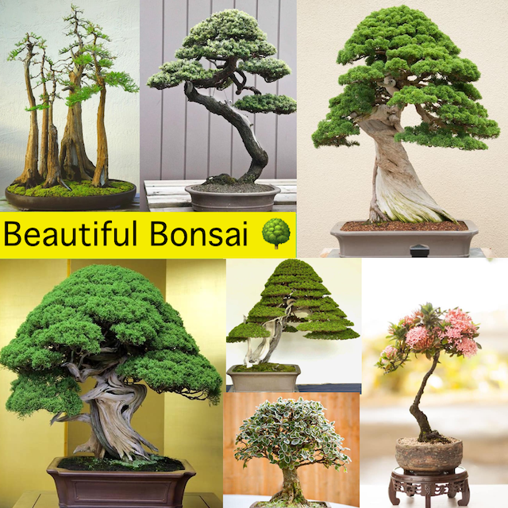
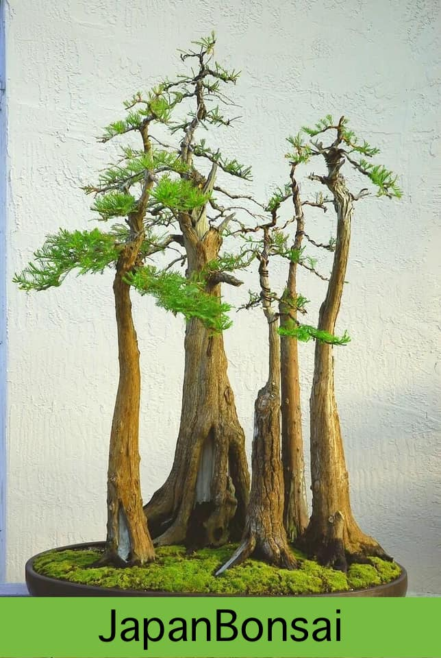
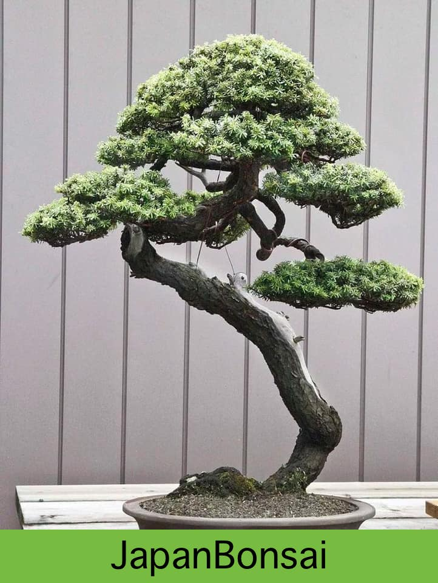
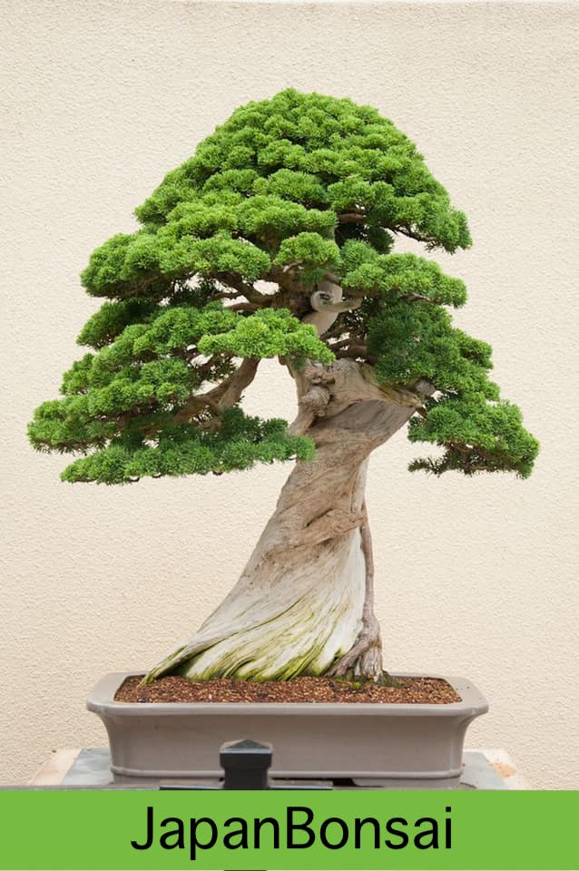
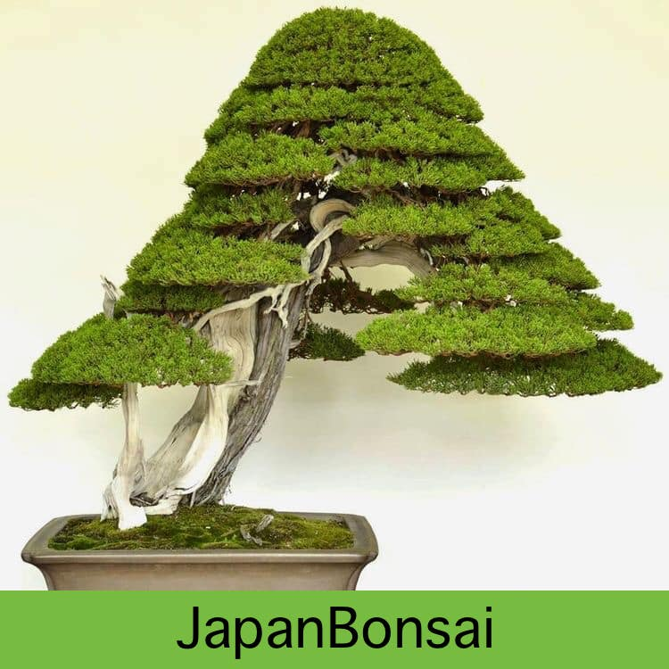
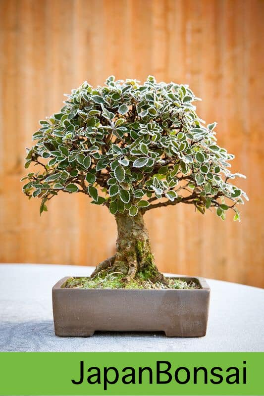
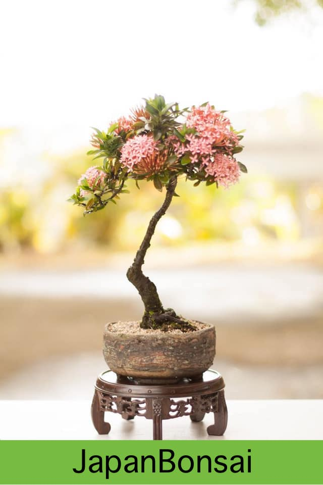
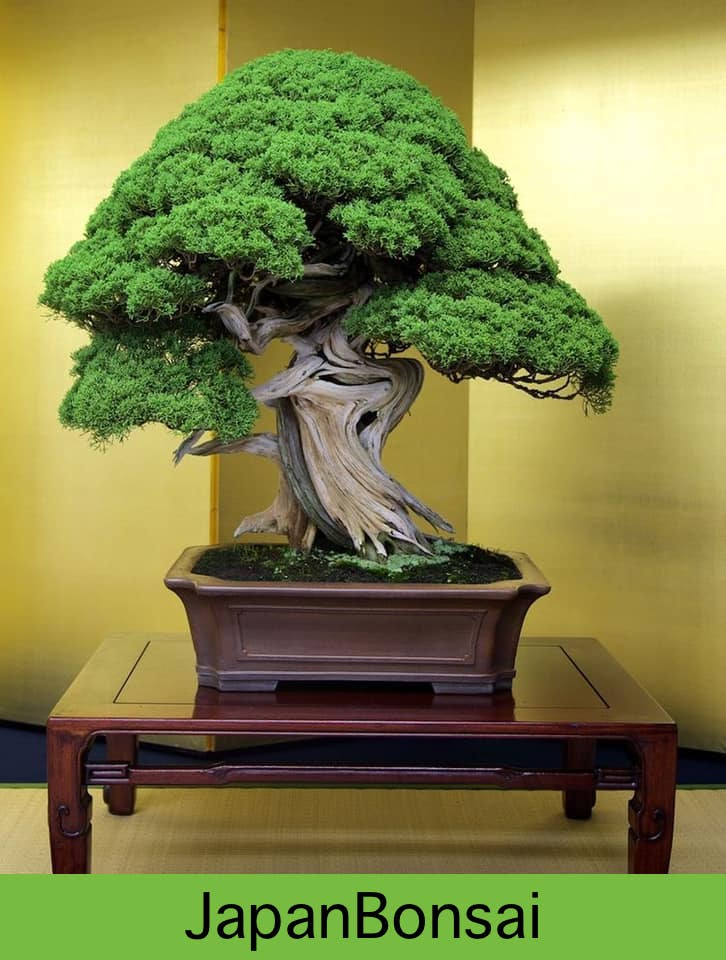

<!--adsense-->

<!--adsense-->

<!--adsense-->

<!--adsense-->

<!--adsense-->

<!--adsense-->

<!--adsense-->

1. [All You Need To Know About Bonsai 'How bonsai works'](https://japanbonsaigarden.com/posts/posts/bonsai_care/)
2. [How to look after my bonsai](https://japanbonsaigarden.com/posts/posts/how_to_carering_your_bonsai/)
3. [Amazing Bonsai Masterpieces](https://japanbonsaigarden.com/posts/posts/masterpieses1/)
4. [Important this to do become bonsai master](https://japanbonsaigarden.com/posts/posts/masterpieses2/)
5. [Amazing Bonsai Images](https://japanbonsaigarden.com/posts/posts/bonsaipost1/)
6. [How to make a bonsai design easily](https://japanbonsaigarden.com/posts/posts/lerningguide1/)
7. [BONSAI](https://japanbonsaigarden.com/posts/posts/introduction/)
8. [Principles of Bonsai](https://japanbonsaigarden.com/posts/posts/principlesofbonsai/)
9. [Bonsai Groth PRINCIPLES](https://japanbonsaigarden.com/posts/posts/bonsaigrouthprincipals/)
10. [Bonsai Types](https://japanbonsaigarden.com/posts/posts/bonsaitypes/)
11. [Bonsai Watering](https://japanbonsaigarden.com/posts/posts/bonsaiwatering/)
12. [Creating A Bonsai For The First Time.](https://japanbonsaigarden.com/posts/posts/biginnerbasics/)
13. [How to grow your own Bonsai](https://japanbonsaigarden.com/posts/posts/bonsaigrowing/)
14. [Trunk and Nebari Rules](https://japanbonsaigarden.com/posts/posts/rulesofbonsai/)
15. [Rules Of Branches](https://japanbonsaigarden.com/posts/posts/rulesofbranches/)
16. [Pots And Culture Rules](https://japanbonsaigarden.com/posts/posts/potsandculturerules/)
17. [BONSAI SOIL](https://japanbonsaigarden.com/posts/posts/bonsaisoil/)

18. [WHAT MAKES GOOD BONSAI](https://japanbonsaigarden.com/posts/posts/whatmakesgoodbonsai/)
