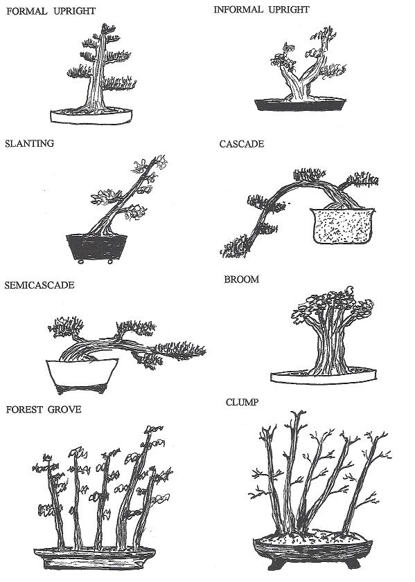

 

### Bonsai Styles
It is important for you to remember, as a beginner, that no single
bonsai style is the “right” style. Bonsai is meant to be a representation
of a tree in nature. Crafting a bonsai masterpiece is tantamount to
how YOU view that tree. You are not learning from a bonsai master,
you are simply being given instruction on how to create your own
bonsai. What you make of it lies simply in your own mind.
There are two general styles of bonsai: the classic (koten) and
the informal or 'comic' (bunjin). In the former, the trunk of the tree is
wider at the base and tapers off towards the top; it is just the opposite
in the 'bunjin', a style more difficult to master.
When you start a bonsai, always remember that you are working
with a living plant. Look carefully at its natural characteristics and you
may discern within them a suitable style, or styles. 
