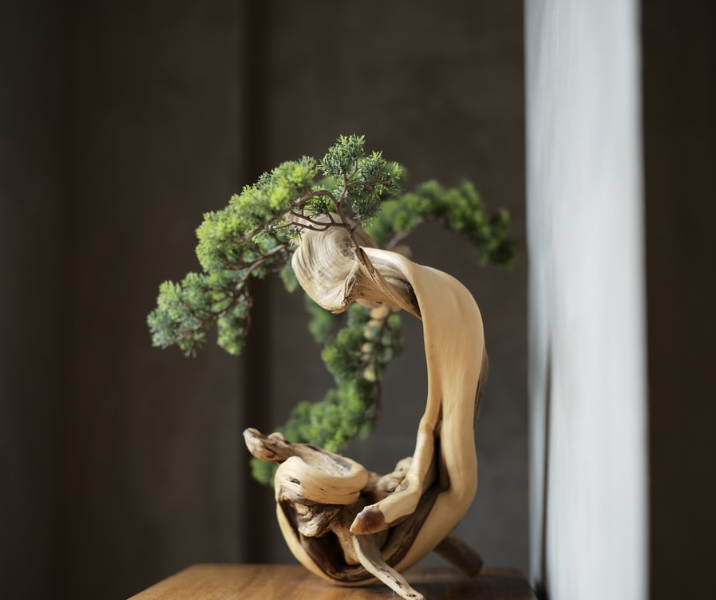

Creating the correct soil conditions and managing the roots and
foliage effectively are the key to success with bonsai. It helps to
know the natural habitat of your current tree since that gives you
an idea of the conditions in which the foliage and roots will thrive.

### Soil matters
It is essential to achieve the correct balance between
water and oxygen in the soil. Constantly
wet soil will cause a buildup of stale
air and waste gases that will affect
both the level of mycorrhizae and
the soil pH, and ultimately your
tree will suffer. Too much or
too little water also soon
affect the tree, so take care.
Bonsai pots are equipped
with generous drainage
holes in the base and
these, coupled with
a fast-draining
soil mixture, or
a layer of large particle soil at the
bottom of the pot, not
only improve drainage
but also ensure that the
soil is correctly aerated. It is not so much about
pushing water out of the soil as letting oxygen in.

<!--adsense-->

### Roots and branches
In a bonsai pot, the function of the root system
is the same as it is for a tree in the open ground.
However, the structure of the roots is also very
important from both an efficiency and an aesthetic
perspective. The root system can be considered to
be a mirror image of the branching system above
the soil: a well-ramified branch system will be
supported by a similarly well-ramified root system,
and a tree that has two very strong roots growing
around and around in the pot will also have two
very strong branches.

<!--adsense-->

It follows that the root system should be set up to
support the branching system and growth that you
desire in the top of the tree. Removing the taproot
at an early age is necessary to promote the growth
of lateral roots, but these must then be regulated to
ensure that they grow evenly across the tree without
any single root becoming dominant. The wellbalanced nebari seen on many mature deciduous
specimens has been achieved through regular work
on the root system with the objective of creating
balanced growth. It is therefore no surprise that the
branching is very fine, well ramified, and balanced
as well. Pruning the tree’s roots is just as important
as pruning its branches—however, prune too much
and the tree will suffer; prune too little and the tree
will not develop in the way in which you hope. One
of the best reasons for working with material from
a bonsai nursery is the fact that the root systems
will have had some work done on them in order for
them to grow successfully as bonsai.

1. [All You Need To Know About Bonsai 'How bonsai works'](https://srilankasl.com/posts/bonsai_care/)
2. [How to look after my bonsai](https://srilankasl.com/posts/how_to_carering_your_bonsai/)
3. [Amazing Bonsai Masterpieces](https://srilankasl.com/posts/masterpieses1/)
4. [Important this to do become bonsai master](https://srilankasl.com/posts/masterpieses2/)
5. [Amazing Bonsai Images](https://srilankasl.com/posts/bonsaipost1/)
6. [How to make a bonsai design easily](https://srilankasl.com/posts/lerningguide1/)
7. [BONSAI](https://srilankasl.com/posts/introduction/)
8. [Principles of Bonsai](https://srilankasl.com/posts/principlesofbonsai/)
9. [Bonsai Groth PRINCIPLES](https://srilankasl.com/posts/bonsaigrouthprincipals/)
10. [Bonsai Types](https://srilankasl.com/posts/bonsaitypes/)
11. [Bonsai Watering](https://srilankasl.com/posts/bonsaiwatering/)
12. [Creating A Bonsai For The First Time.](https://srilankasl.com/posts/biginnerbasics/)
13. [How to grow your own Bonsai](https://srilankasl.com/posts/bonsaigrowing/)
14. [Trunk and Nebari Rules](https://srilankasl.com/posts/rulesofbonsai/)
15. [Rules Of Branches](https://srilankasl.com/posts/rulesofbranches/)
16. [Pots And Culture Rules](https://srilankasl.com/posts/potsandculturerules/)
17. [BONSAI SOIL](https://srilankasl.com/posts/bonsaisoil/)

18. [WHAT MAKES GOOD BONSAI](https://srilankasl.com/posts/whatmakesgoodbonsai/)

<!--adsense-->

[Source](https://www.goodreads.com/book/show/23340541-bonsai)

[Bonsai by Peter Warren](https://www.goodreads.com/book/show/23340541-bonsai)
