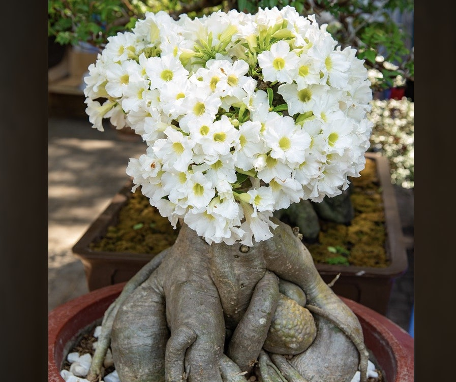

Creating the correct soil conditions and managing the roots and
foliage effectively are the key to success with bonsai. It helps to
know the natural habitat of your current tree since that gives you
an idea of the conditions in which the foliage and roots will thrive.

### MOYOGI /Informal Upright

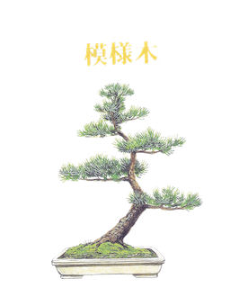

This is a variation on the formal upright style but is much easier
to create.
The rules for the branch structure are the same but the trunk
may have any number of curves, both from left to right and from
front to back.
The tree illustrated is just one of the many variations
on the informal upright style.
Unlike the Formal Upright, Moyogi works equally well with
deciduous and coniferous species.
The branches should ideally grow from the outside of the curves
and never on the inside as this creates a shock to the eye.
The apex should lean towards the front.

<!--adsense-->

### CHOKKAN / Formal Upright

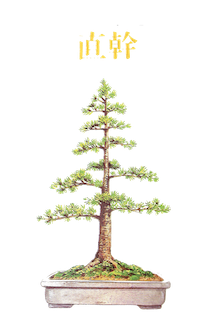

As the name implies, this is the most formalised of all styles.
The trunk must be ramrod straight and bolt upright, tapering
uniformly from base to tip.
The branches should be arranged alternately either side of the
trunk with every third branch to the rear.
The branches should diminish in thickness and in length from the
lowest one upwards, and should be either horizontal or
sloping downwards.
Ideally, the spaces between the branches should also diminish
toward the top of the tree, in proportion to their thickness and
length.

<!--adsense-->

### SHAKAN / Slanting

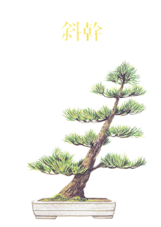

Another variation on the formal upright style, except that it is
not upright.
The trunk is usually straight-ish, although it may have a gentle
curve or two.
The placement of the branches needs to be carefully thought out
in order to stabilise the design and to prevent the tree looking as
if it is about to fall over.
Unlike the previous two styles, the number and placement of the
branches is less crucial, providing the opportunity for creativity.
For instance, using only the top branches and training them down
steeply can result in a dramatic image.

<!--adsense-->
### FUKINAGASHI / Windswept

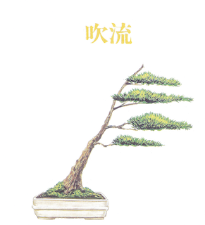

Although this is one of the more naturalistic styles, it is also one
of the most dramatic.
The aim is to capture the dynamic shape and movement of a
tree living high in the mountains or on a clifftop, where it is
constantly exposed to high prevailing winds.
There are no rules governing the trunk shape or location of
branches, but in spite of this freedom this is one of the most
difficult styles to create successfully.
The difficulty lies in making the image appear authentic, rather
than merely looking like a tree with branches on one side.
The trick is to ensure that the windswept effect begins at the
base of the trunk and is reflected in every aspect of the tree.

<!--adsense-->

### HAN-KENGAI / Semi-Cascade

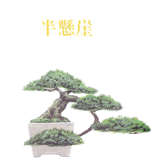

Both this style and the cascade style depict trees clinging to a
cliff face, where they are beaten by snow, wind and rockfalls.
The trunk should have dramatic curves and taper, and the branches
should ideally also cascade from the trunk.
Tradition states that the inverted ‘apex’ should be positioned
directly below the base of the trunk when the tree is viewed
from the ‘front’, but this can inhibit the design somewhat.
These days it’s perfectly acceptable to allow the lowest point of
the tree to be placed to one side of the pot, as if it was reaching
out from a cliff face to find light.
The one unbreakable rule is that the lowest point must be below
the rim of the pot, but not its base.

<!--adsense--> 

### KENGAI / Cascade

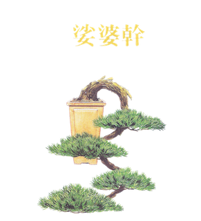

The difference between this style and the semi-cascade is that
here the trunk must fall below the base of the pot.
All other criteria are the same.
Good cascades are rare because of the difficulty in maintaining
vigour in the lower parts of the tree, opposing its natural urge
to grow upwards.
This is probably the most difficult of all styles to design
convincingly, partly because of the horticultural problem, but
mainly because we have few natural examples to recall as
inspiration.
It is important to include dramatic features and sharp angles to
evoke the feeling of a tree clinging to life in the harsh mountain
conditions.

<!--adsense--> 
### SHARIMIKI / Driftwood style

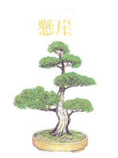

Echoing the natural appearance of mountain junipers, which
produce areas of bare, sun-bleached wood as they age, this style
is seldom successfully created from other species.
The focal point is the beautiful and dramatic shapes of the grain
in the exposed wood.
These shapes may be natural but are more often elaborately
carved and then bleached and preserved with lime-sulphur.
The foliage masses, although acknowledging some of the rules
of other styles, serve more as a foil or frame to the driftwood.
This style is suitable for conifers and rarely, if ever, applied to
deciduous species of bonsai tree.

<!--adsense-->

### HOKIDACHI / Broom style

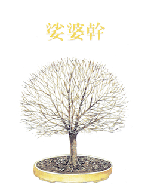

This style was modelled on the natural habit of the zelkova and
is seldom successfully used for other than related species, since
it works best with trees bearing alternate foliage.
All branches should emerge from the top of a straight trunk and
fork at regularly diminishing internals until a network of fine
shoots at the tips forms an even-domed crown.
For broom styles to work well, they must be perfectly symmetrical
and meticulously trained and pruned to ensure an even and
gradual transition from trunk, through heavy branches, to the
finest terminal shoots.
Trying to rush the development will always end in
disappointment.

<!--adsense-->

### BUNJINGI / Literati

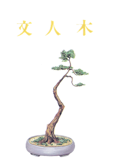

This style is reminiscent of ancient pines, which tend to shed
their lower branches as they get old.
It gets its name from the calligraphic style of ancient Chinese
artists.
The focal point of the design is the trunk, so it should be full of
character.
The branches are limited to the uppermost part of the trunk and
should bear just enough foliage to keep the tree healthy and
vigorous.
The foliage should, however, be immaculately positioned.
The pots used for literati styles are generally round and
comparatively small to balance the sparse foliage.
They are also frequently’rustic’ in appearance, to reflect the
tree’s rocky habitat.

<!--adsense-->

### SEKIJÔJU / Root on Rock

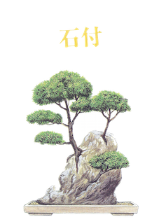

In rocky terrain the scarce soil is constantly being eroded,
exposing the rocks and the roots of the trees growing amongst
them.
This style depicts such a tree whose roots, as they thicken, cling
to any rocks beneath them.
The tree itself can be of any style, although broom and formal
upright styles look out of place.
The most important factor is that the roots should cling tightly
to the rock and should have a mature texture.
This can take many years to accomplish.
First, the root-covered rock must first be planted in the ground
for several seasons to consolidate, and then exposed to the air
and sun for the bark to develop mature characteristics.

<!--adsense-->
### SHARIMIKI / Driftwood

Echoing the natural appearance of mountain junipers, which
produce areas of bare, sun-bleached wood as they age, this style
is seldom successfully created from other species.
The focal point is the beautiful and dramatic shapes of the grain
in the exposed wood.
These shapes may be natural but are more often elaborately
carved and then bleached and preserved with lime-sulphur.
The foliage masses, although acknowledging some of the rules
of other styles, serve more as a foil or frame to the driftwood.
This style is suitable for conifers and rarely, if ever, applied to
deciduous species of bonsai tree.

<!--adsense-->
### IKADABUKI / Strait raft

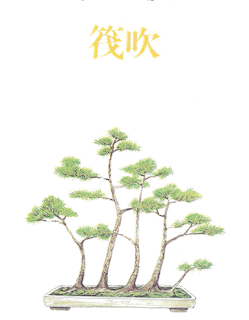

Another obvious one: a raft planting where the original trunk lies
in a straight line.
Most rafts created from nursery stock follow this style because of
the difficulty of bending a fairly thick trunk into sinuous curves.In
such cases the trunk is usually buried in the soil or covered with
moss to disguise its unnatural appearance.
The main problem to solve when making a straight raft is how to
avoid a straight row of trunks.
This can be achieved by training some branches horizontally
forward or backward before bending them up to form trunks.
It is even possible to create a fairly dense forest in this way.

<!--adsense-->
### NEAGARI / Exposed Roots

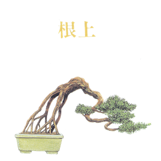

Most of us have driven down lanes where the steep banks have
been washed away to expose the roots of an ancient beech or
pine, and this style is based on such cases.
The roots, which must have mature bark and interesting shapes,
add a dramatic, rugged appearance, so the design of the tree
itself should echo this.
The foliage mass should be kept fairly small so that its weight or
wind resistance doesn’t cause the exposed roots to bend over.
You might find wild specimens that lend themselves to training
in this style, but more often than not, growing from scratch is
the easiest method.

<!--adsense-->

[Source](https://bonsaisarajevo.files.wordpress.com/2015/12/bonsai-styles.pdf)

1. [All You Need To Know About Bonsai 'How bonsai works'](https://srilankasl.com/posts/bonsai_care/)
2. [How to look after my bonsai](https://srilankasl.com/posts/how_to_carering_your_bonsai/)
3. [Amazing Bonsai Masterpieces](https://srilankasl.com/posts/masterpieses1/)
4. [Important this to do become bonsai master](https://srilankasl.com/posts/masterpieses2/)
5. [Amazing Bonsai Images](https://srilankasl.com/posts/bonsaipost1/)
6. [How to make a bonsai design easily](https://srilankasl.com/posts/lerningguide1/)
7. [BONSAI](https://srilankasl.com/posts/introduction/)
8. [Principles of Bonsai](https://srilankasl.com/posts/principlesofbonsai/)
9. [Bonsai Groth PRINCIPLES](https://srilankasl.com/posts/bonsaigrouthprincipals/)
10. [Bonsai Types](https://srilankasl.com/posts/bonsaitypes/)
11. [Bonsai Watering](https://srilankasl.com/posts/bonsaiwatering/)
12. [Creating A Bonsai For The First Time.](https://srilankasl.com/posts/biginnerbasics/)
13. [How to grow your own Bonsai](https://srilankasl.com/posts/bonsaigrowing/)
14. [Trunk and Nebari Rules](https://srilankasl.com/posts/rulesofbonsai/)
15. [Rules Of Branches](https://srilankasl.com/posts/rulesofbranches/)
16. [Pots And Culture Rules](https://srilankasl.com/posts/potsandculturerules/)
17. [BONSAI SOIL](https://srilankasl.com/posts/bonsaisoil/)

18. [WHAT MAKES GOOD BONSAI](https://srilankasl.com/posts/whatmakesgoodbonsai/)
