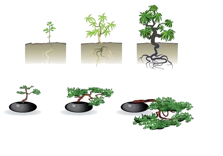

To easily create a bonsai you need to choose a suitable tree but there are three ways you can create an existing plant

### Method 1
Creating a bonsai from a small plant

This is a bit difficult because we have to wait a long time to make a good design but you can create the kind of bonsai you want with this method but it takes a long time because it grows little by little but you have to wait a long time. The good thing is that you can quickly build the kind of tree you want, little by little

<!--adsense-->

### Method 2
In this method you have to go into a nursery and bring back a well grown but not bonsai plant. The resulting plant can be quickly branched and shaped using your bonsai knowledge. This is how you can easily and quickly create a bonsai. This type of bonsai plant can be made in less than three months. There are some things to consider when choosing a good looking plant, namely the shape of the tree, the height of the hill. Whether there is a good decorative branch system and whether the tree is suitable for creation .The reason is that it is difficult to bring a plant that is not suitable for making a bonsai and make a bonsai plant, so what you should expect when choosing this type of plant is to choose a plant with shorter leaves and more branches. Below is a picture to look out for. This is a great way for an amateur to bonsai
[https://i.pinimg.com/564x/3f/78/98/3f7898c09ec3cfdd84e4bc79e758c79f.jpg](https://hubpages.com/living/A-Beginners-Guide-to-Bonsai)

### Method No. 3
The system is called Yamadori. All you have to do in this method is to select a plant that has grown well in the ground and cut it down as we want and go for a design. This also makes it very easy and fast to make a plant look the way we want it. You can get an idea of ​​this by selecting a plant that is well grown in the ground and cutting it into small pieces as needed so that the large mountain plants that have been cut can be made to grow as time goes on and you can even see about it and a picture is given below. This method is also easy. It is also possible to make a plant beautifully. The above method is also somewhat easy but you have to have some understanding while using these things such as pruning the branches and separating the shape of the branches etc. The reason we do this is by listening to the grass growing well in the ground. You have no idea how many embellishments to make for a design, so no one came up with an idea, you can get an idea from the photos below.
 <!--adsense-->
[sourse](https://lexicon.typepad.com/bonsai_dilettante/2013/09/free-urban-yamadori-boxwoods.html)

1. [All You Need To Know About Bonsai 'How bonsai works'](https://srilankasl.com/posts/bonsai_care/)
2. [How to look after my bonsai](https://srilankasl.com/posts/how_to_carering_your_bonsai/)
3. [Amazing Bonsai Masterpieces](https://srilankasl.com/posts/masterpieses1/)
4. [Important this to do become bonsai master](https://srilankasl.com/posts/masterpieses2/)
5. [Amazing Bonsai Images](https://srilankasl.com/posts/bonsaipost1/)
6. [How to make a bonsai design easily](https://srilankasl.com/posts/lerningguide1/)
7. [BONSAI](https://srilankasl.com/posts/introduction/)
8. [Principles of Bonsai](https://srilankasl.com/posts/principlesofbonsai/)
9. [Bonsai Groth PRINCIPLES](https://srilankasl.com/posts/bonsaigrouthprincipals/)
10. [Bonsai Types](https://srilankasl.com/posts/bonsaitypes/)
11. [Bonsai Watering](https://srilankasl.com/posts/bonsaiwatering/)
12. [Creating A Bonsai For The First Time.](https://srilankasl.com/posts/biginnerbasics/)
13. [How to grow your own Bonsai](https://srilankasl.com/posts/bonsaigrowing/)
14. [Trunk and Nebari Rules](https://srilankasl.com/posts/rulesofbonsai/)
15. [Rules Of Branches](https://srilankasl.com/posts/rulesofbranches/)
16. [Pots And Culture Rules](https://srilankasl.com/posts/potsandculturerules/)
17. [BONSAI SOIL](https://srilankasl.com/posts/bonsaisoil/)

18. [WHAT MAKES GOOD BONSAI](https://srilankasl.com/posts/whatmakesgoodbonsai/)
