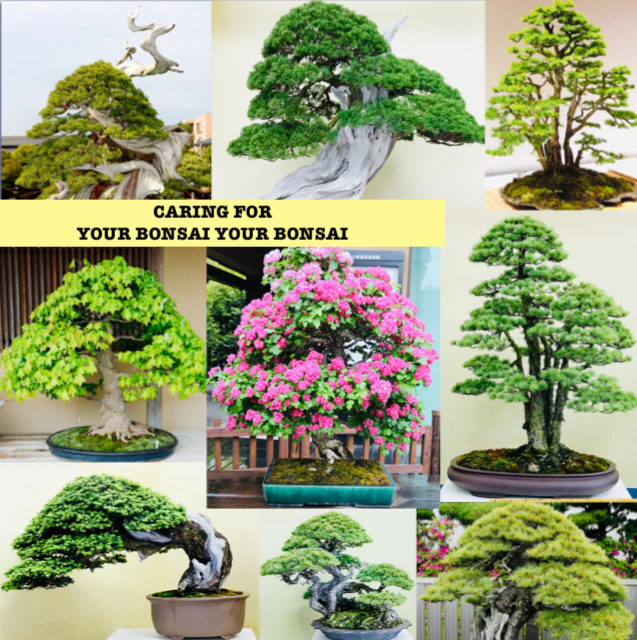
 <!--adsense-->

When it comes to protecting a bonsai tree, watering, spraying, fertilizing the tree, and protecting our bonsai plant from seasonal changes, protection are just some of the things to keep in mind.
# WATERING
### When?
How often your Bonsai tree needs watering will depend on a number of different
factors.
Water your trees when the soil gets slightly dry.
Use your fingers to check the soil at around one centimetre deep for dryness.
If your tree does require water, soak thoroughly, so the entire root system is
wetted. To do so, keep watering until water runs out of the drainage holes, and
possibly repeat the process a few minutes later.
## HOW?
Water your tree from above using a watering can with a fine nozzle. this will
prevent the soil from being washed away.

# FERTILISING YOUR BONSAI
### When?
Most Bonsai trees should be fertilised during the entire growth season of the
tree. from early Spring until mid-Autumn. For best results fertilise indoor trees all
year round. However, take the time to consider the species of your tree, the
health of your tree and the stage of development; for example older and more
mature trees can be fertilised less frequently.

### Which Fertiliser?
You can choose to use either a liquid or granular fertiliser. Bonsai specific
fertilisers can be purchased from any good garden retailer.
How?
Feed your Bonsai using the quantities and frequency stated on the fertiliser
packaging. You can choose to reduce the recommended quantity slightly for
trees that are not in training, to balance their growth instead of stimulating it.
It is very important not to overfeed your tree.

 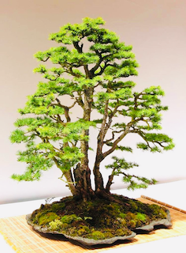
 <!--adsense-->

#SEASONAL CARE
###During Cold Months
During the Autumn in colder areas, hardy or evergreen trees start preparing for
the coming Winter by hardening up new growth and (for deciduous trees)
dropping leaves to reduce moisture loss. This period of dormancy is important
for Bonsai trees, so you don’t need to bring them indoors.
Subtropical trees are different, these should be brought indoors during the
Winter if temperatures drop below 15 degrees Celsius. In warm climates they
can remain outside all year round. When indoors, tropical trees need lots of light
and relatively high humidity. A spot in front of a north-facing window will provide
the right amount of light.
 
### During Warmer Months
It is recommended to protect your Bonsai from high temperatures during the
warmer months of the year.
If temperatures start to exceed 30 degrees Celsius these simple measures will
help keep your Bonsai hydrated and healthy.
* Place your Bonsai in a shady position out of direct sunlight
* Maintain humidity by misting both the Bonsai and the ground
around the Bonsai
* Check the soil for dryness - additional watering may be required
* A thorough watering in the late morning will ensure the soil is still
moist at the end of the hottest part of the day

1. [All You Need To Know About Bonsai 'How bonsai works'](https://japanbonsaigarden.com/posts/posts/bonsai_care/)
2. [How to look after my bonsai](https://japanbonsaigarden.com/posts/posts/how_to_carering_your_bonsai/)
3. [Amazing Bonsai Masterpieces](https://japanbonsaigarden.com/posts/posts/masterpieses1/)
4. [Important this to do become bonsai master](https://japanbonsaigarden.com/posts/posts/masterpieses2/)
5. [Amazing Bonsai Images](https://japanbonsaigarden.com/posts/posts/bonsaipost1/)
6. [How to make a bonsai design easily](https://japanbonsaigarden.com/posts/posts/lerningguide1/)
7. [BONSAI](https://japanbonsaigarden.com/posts/posts/introduction/)
8. [Principles of Bonsai](https://japanbonsaigarden.com/posts/posts/principlesofbonsai/)
9. [Bonsai Groth PRINCIPLES](https://japanbonsaigarden.com/posts/posts/bonsaigrouthprincipals/)
10. [Bonsai Types](https://japanbonsaigarden.com/posts/posts/bonsaitypes/)
11. [Bonsai Watering](https://japanbonsaigarden.com/posts/posts/bonsaiwatering/)
12. [Creating A Bonsai For The First Time.](https://japanbonsaigarden.com/posts/posts/biginnerbasics/)
13. [How to grow your own Bonsai](https://japanbonsaigarden.com/posts/posts/bonsaigrowing/)
14. [Trunk and Nebari Rules](https://japanbonsaigarden.com/posts/posts/rulesofbonsai/)
15. [Rules Of Branches](https://japanbonsaigarden.com/posts/posts/rulesofbranches/)
16. [Pots And Culture Rules](https://japanbonsaigarden.com/posts/posts/potsandculturerules/)
17. [BONSAI SOIL](https://japanbonsaigarden.com/posts/posts/bonsaisoil/)

18. [WHAT MAKES GOOD BONSAI](https://japanbonsaigarden.com/posts/posts/whatmakesgoodbonsai/)
 
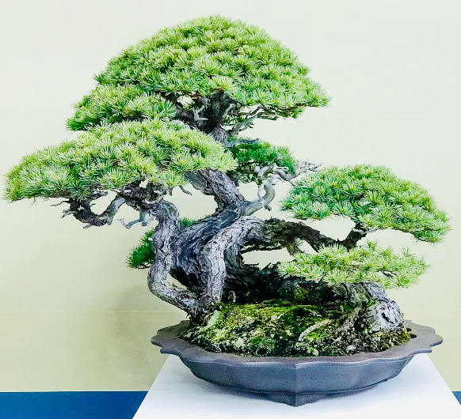
<!--adsense-->
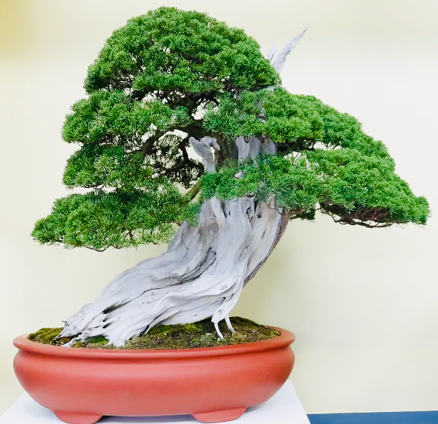
<!--adsense-->
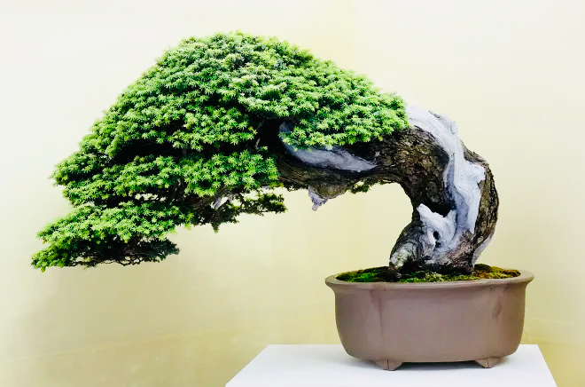
<!--adsense-->
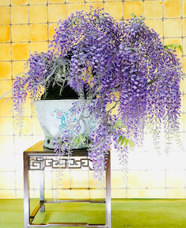
<!--adsense-->
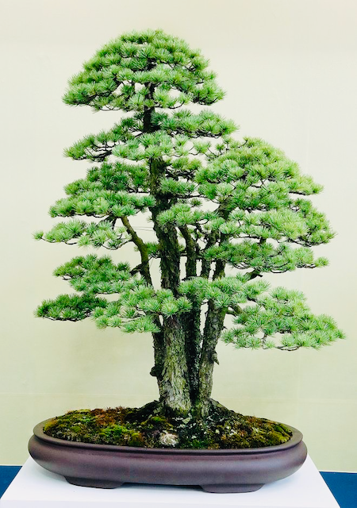
<!--adsense-->
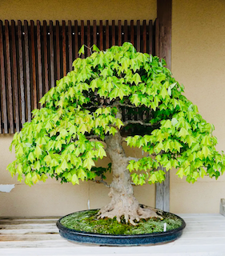
<!--adsense-->
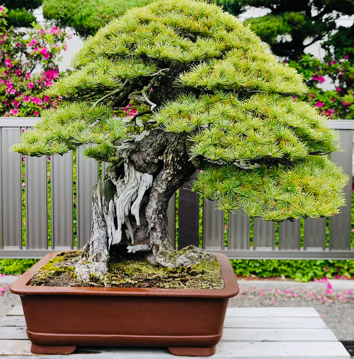
<!--adsense-->
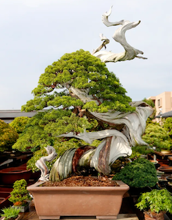
<!--adsense-->
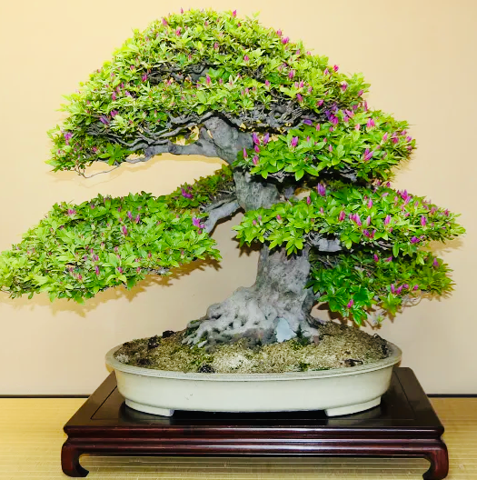

[InformationCredit](https://www.mrfothergills.com.au/media/wysiwyg/Bonsai-Booklet.pdf)

[ImageCredit](https://valavanisbonsaiblog.com/)
