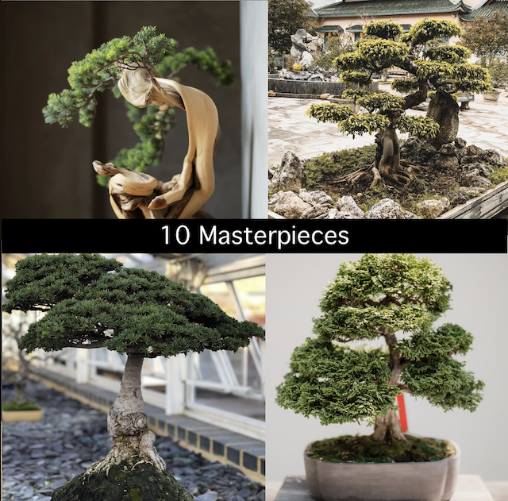
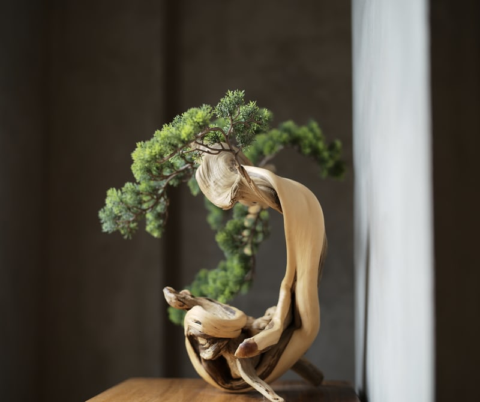
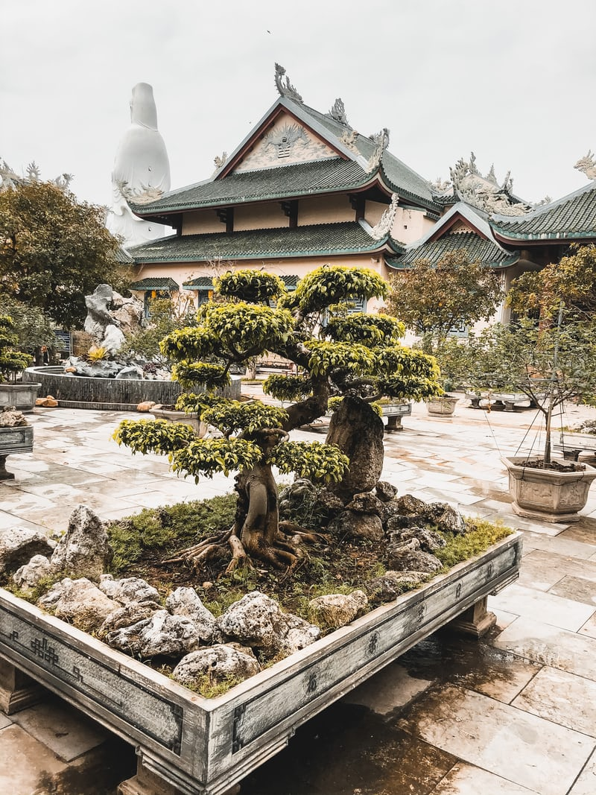
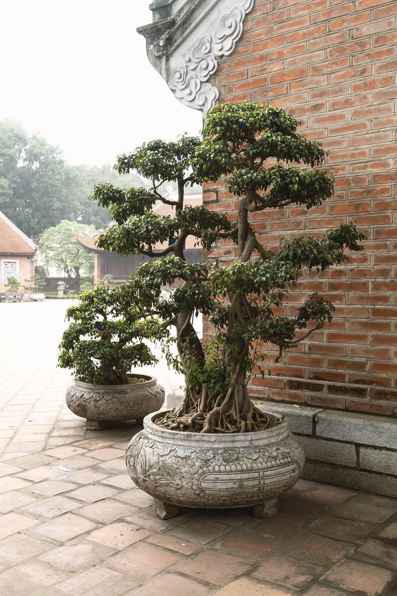
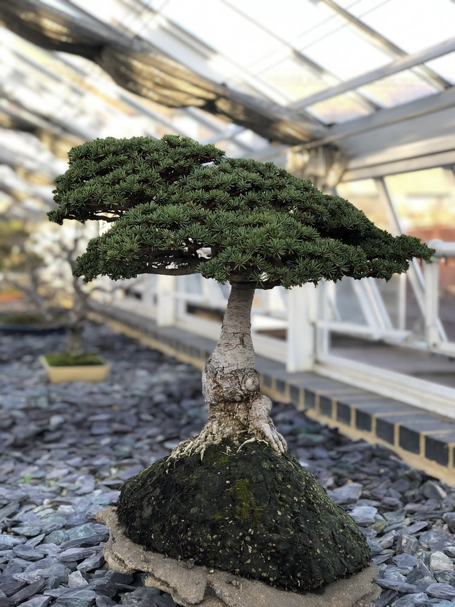
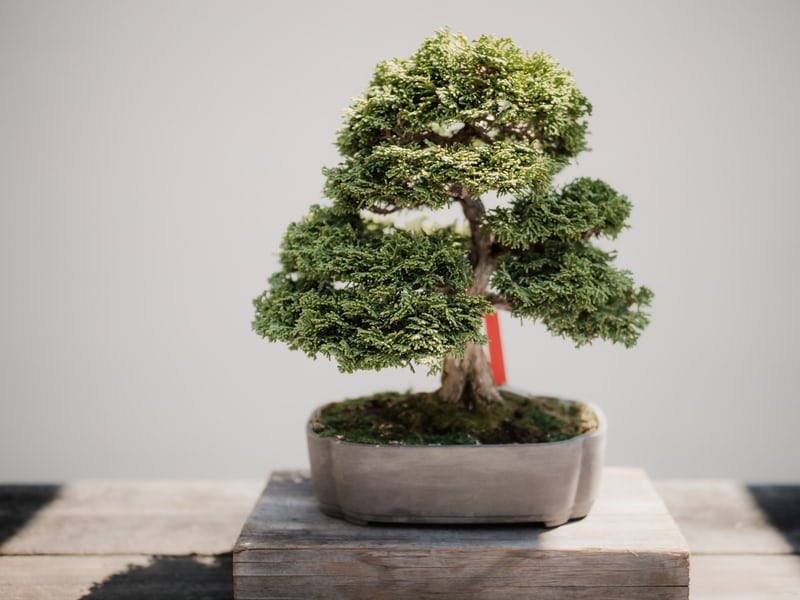
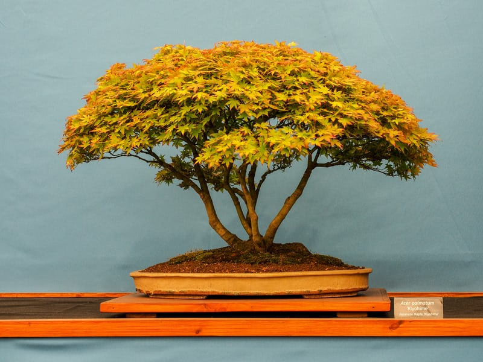
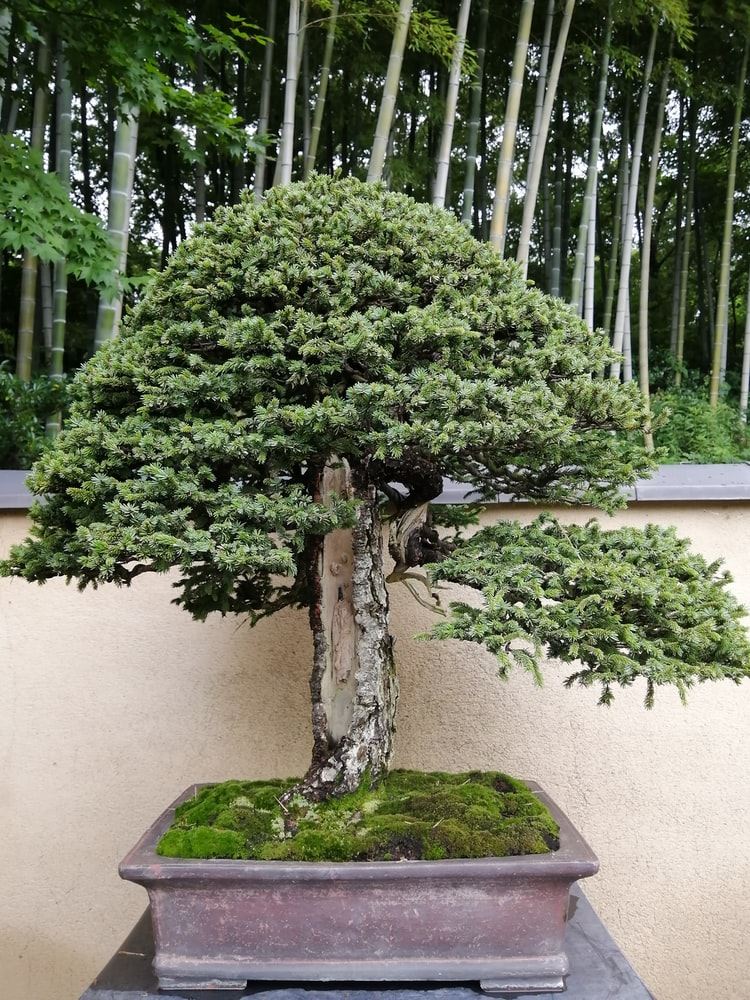
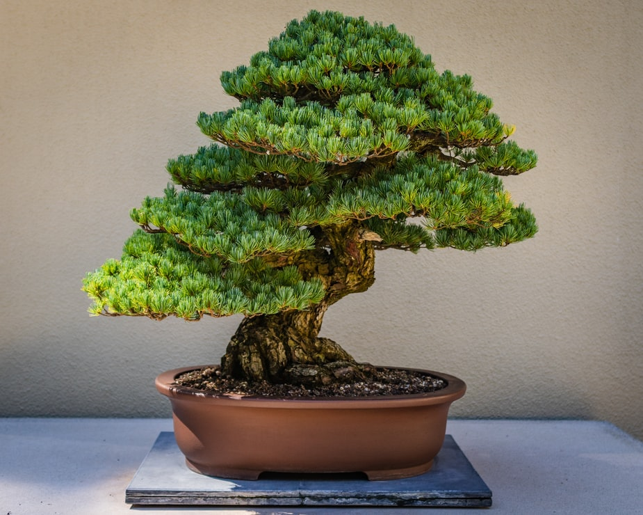
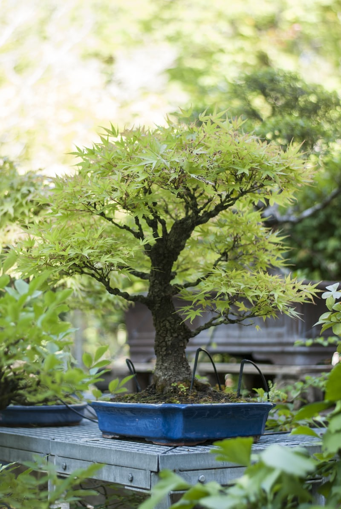

The Japan Bonsai of bonsai Art’s collection contains over 1000+ works of art from all cultures and time periods spanning 100 years of human creativity. The collection is dynamic; new acquisitions are being added all the time and the bonsai gallery are constantly changing. Below is a selection of highlights from the bonsai encyclopedic collection currently on view.

