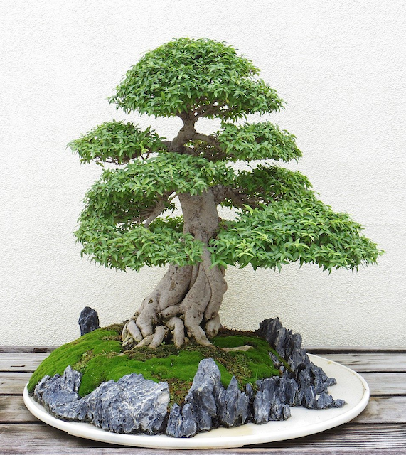

### Important this to Do

<!--adsense-->
* choose suitable trees that adapt for local climatic conditions.
* Find the simple container with adequate drainage.
* Plant Tree in correct position in a container
* Do potting and re-potting at right time.

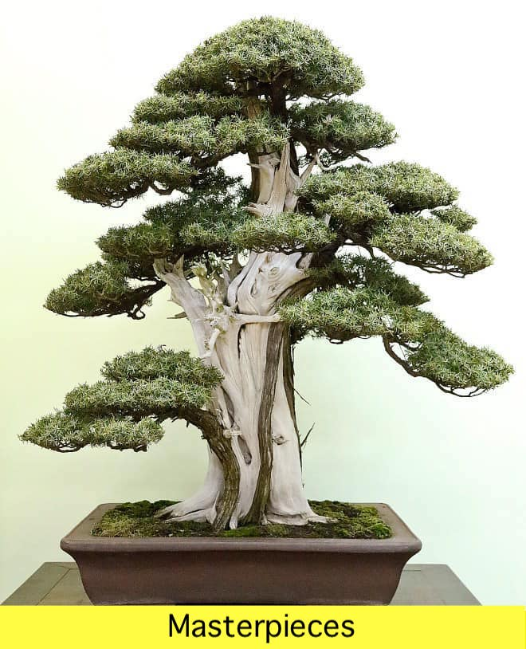
 
 
<!--adsense-->
* Carefully eliminate air pockets during potting and re-potting.
* Tree has to trim or prune regularly(Two month or decide its right time) to produce a fine network of shoots.
* Give good open air with sunlight.
* We should provide balanced nutrition and use  fertilizers or slow release
fertilizers.
  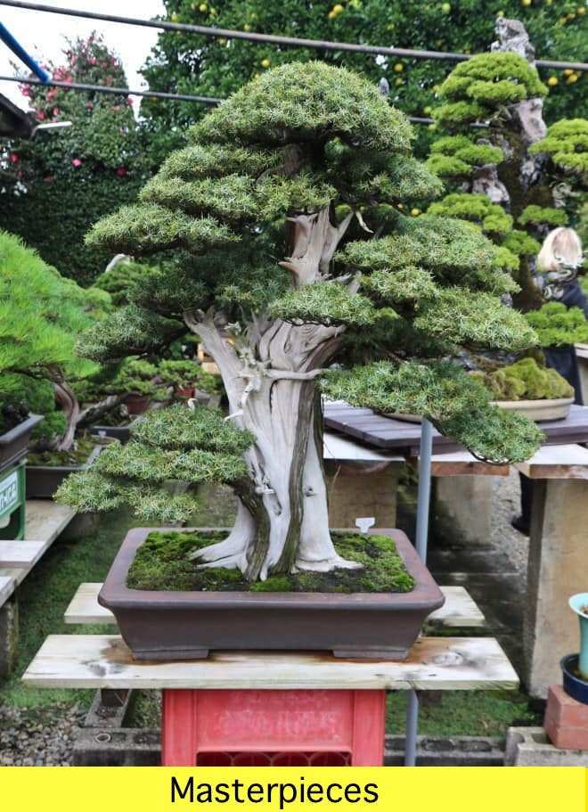
   
   
 
<!--adsense-->
* when watering put water until water comes out of drainage hole.
* Check regularly drainage(if it is a block or not) as water logging is very harmful.
* Do regular inspection for insect-pests and diseases.
* first draw or think good design then develop a design suitable for the species.
* When you are designing a tree,design must be well-balanced and natural looking.
* Most Importent is give your love and affection by proper and constant care.  
   
   
  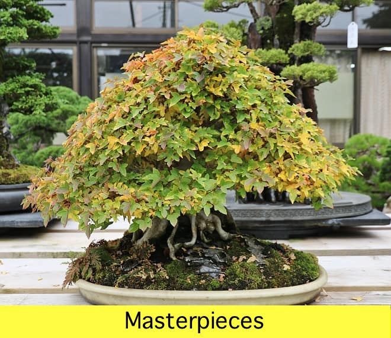
<!--adsense-->
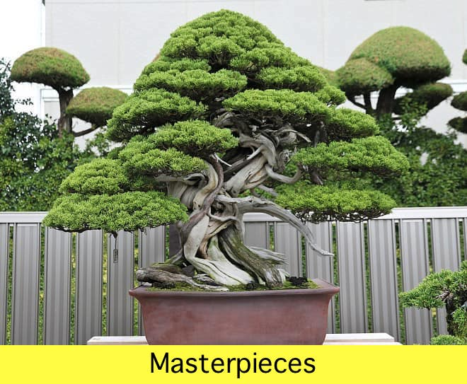
<!--adsense-->
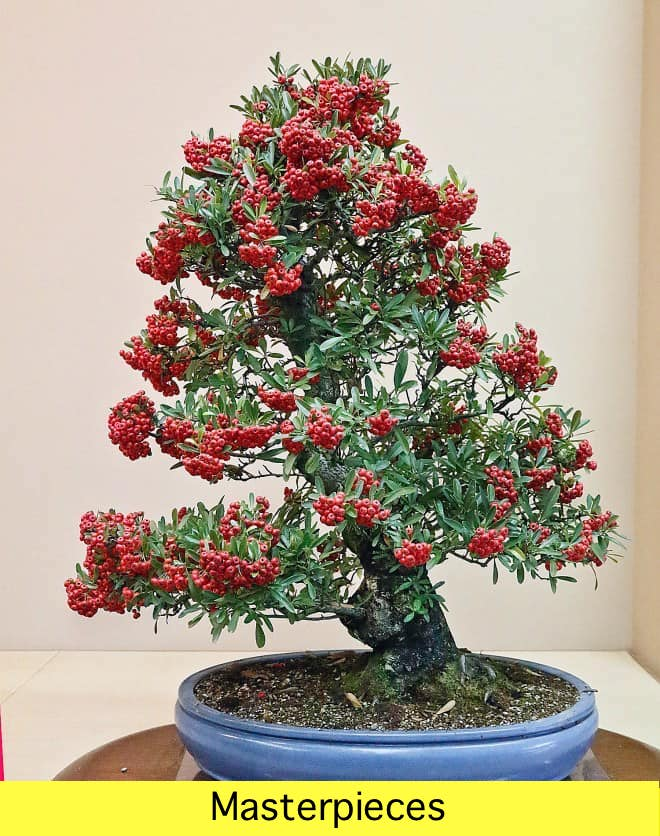
<!--adsense-->
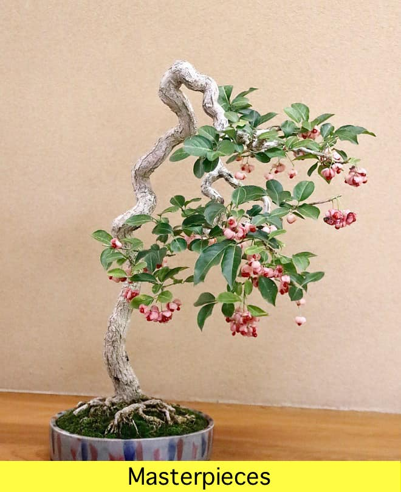
<!--adsense-->
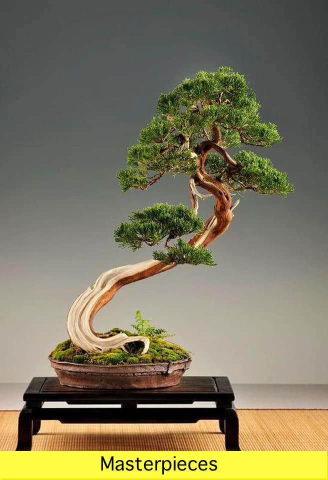
<!--adsense-->
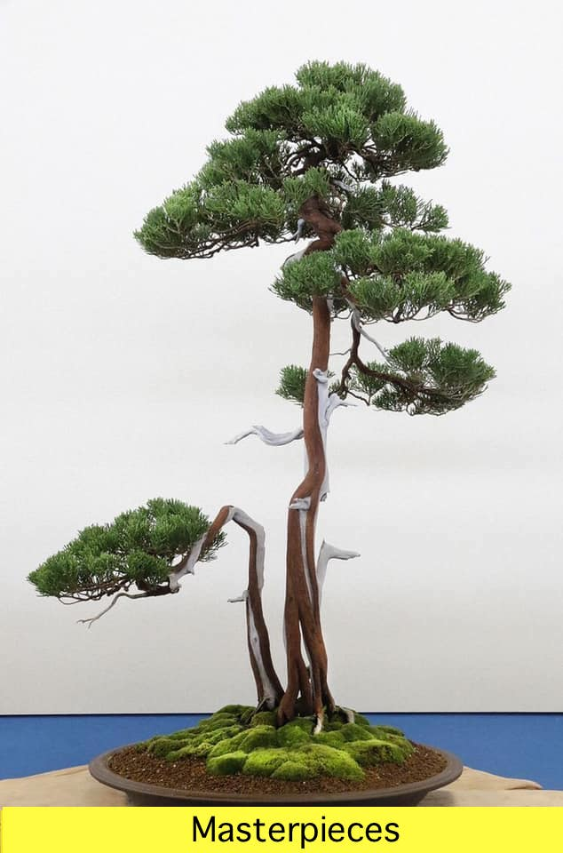
<!--adsense-->
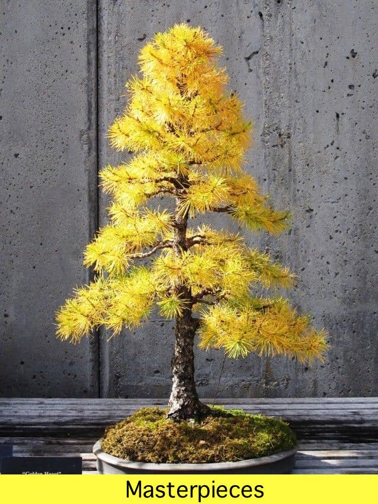
<!--adsense-->
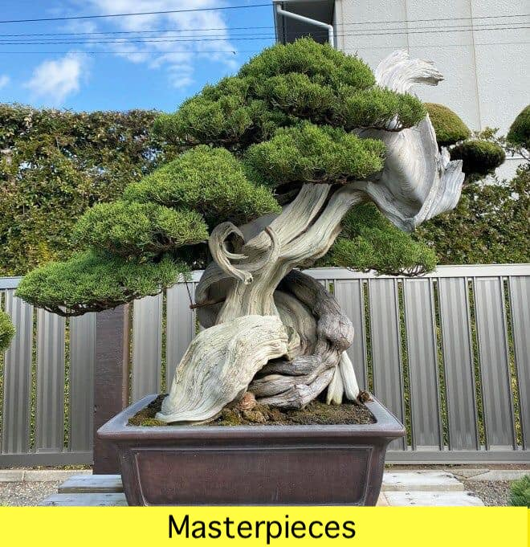
<!--adsense-->
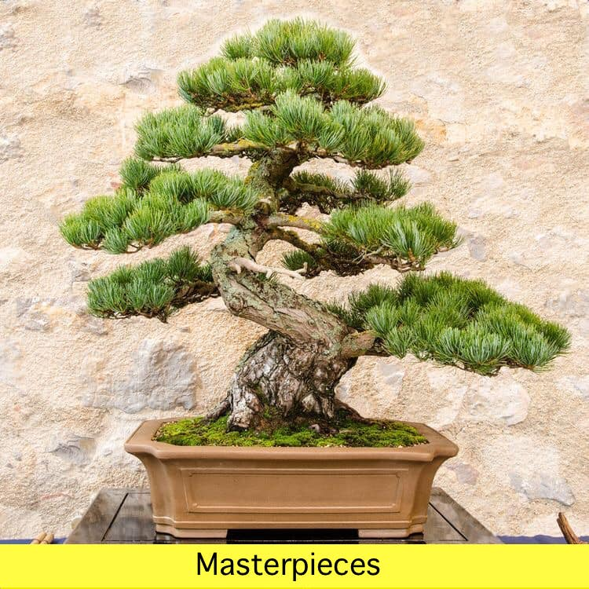
<!--adsense-->

1. [All You Need To Know About Bonsai 'How bonsai works'](https://srilankasl.com/posts/bonsai_care/)
2. [How to look after my bonsai](https://srilankasl.com/posts/how_to_carering_your_bonsai/)
3. [Amazing Bonsai Masterpieces](https://srilankasl.com/posts/masterpieses1/)
4. [Important this to do become bonsai master](https://srilankasl.com/posts/masterpieses2/)
5. [Amazing Bonsai Images](https://srilankasl.com/posts/bonsaipost1/)
6. [How to make a bonsai design easily](https://srilankasl.com/posts/lerningguide1/)
7. [BONSAI](https://srilankasl.com/posts/introduction/)
8. [Principles of Bonsai](https://srilankasl.com/posts/principlesofbonsai/)
9. [Bonsai Groth PRINCIPLES](https://srilankasl.com/posts/bonsaigrouthprincipals/)
10. [Bonsai Types](https://srilankasl.com/posts/bonsaitypes/)
11. [Bonsai Watering](https://srilankasl.com/posts/bonsaiwatering/)
12. [Creating A Bonsai For The First Time.](https://srilankasl.com/posts/biginnerbasics/)
13. [How to grow your own Bonsai](https://srilankasl.com/posts/bonsaigrowing/)
14. [Trunk and Nebari Rules](https://srilankasl.com/posts/rulesofbonsai/)
15. [Rules Of Branches](https://srilankasl.com/posts/rulesofbranches/)
16. [Pots And Culture Rules](https://srilankasl.com/posts/potsandculturerules/)
17. [BONSAI SOIL](https://srilankasl.com/posts/bonsaisoil/)

18. [WHAT MAKES GOOD BONSAI](https://srilankasl.com/posts/whatmakesgoodbonsai/)
